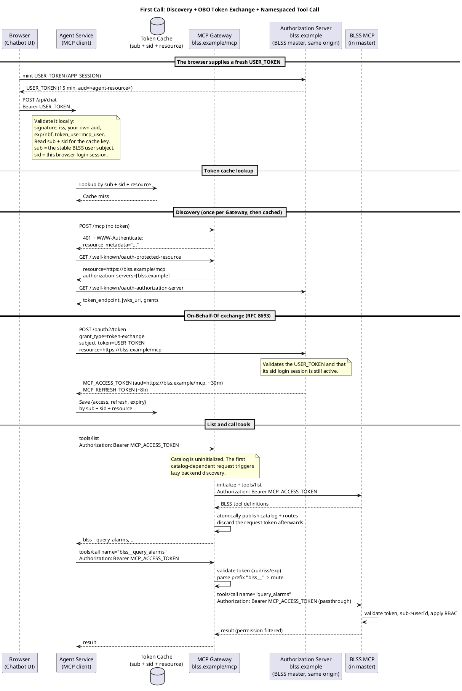
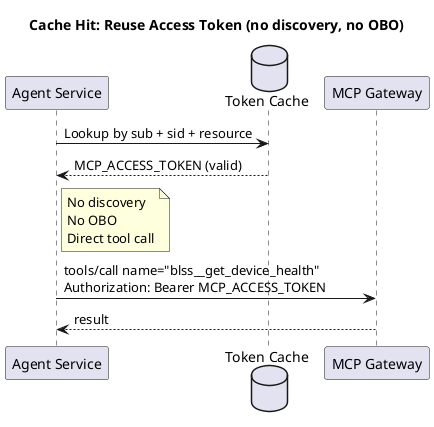
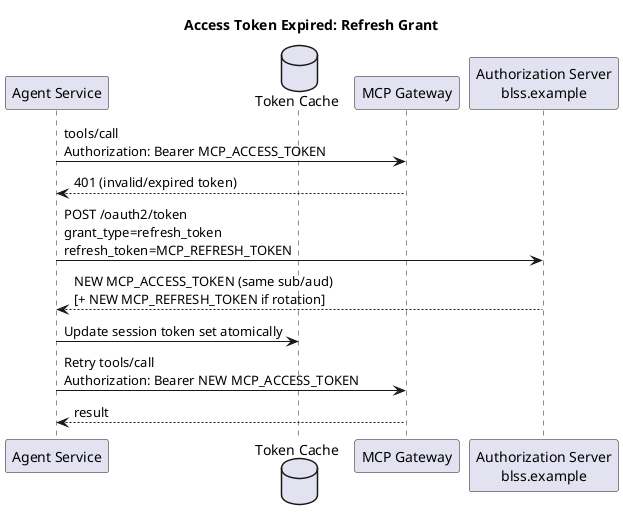
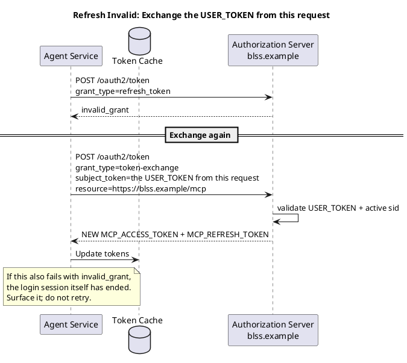

# Agent Integration Guide — Using the BLSS MCP Gateway

> Audience: the **Agent Service team** (the public MCP client that calls the BLSS MCP Gateway on behalf of an end user).
> Purpose: describe, from the Agent's point of view, how to authenticate and how to discover and call BLSS MCP tools.
> Scope: this document covers what the **Agent** must do. Server-side components (Authorization Server, Gateway, backends) are described only as far as the Agent interacts with them.
>
> **Contract status:** this guide describes the multi-backend Gateway contract defined by
> `gateway-obo-token-exchange`. The Gateway side is implemented; the demo tools that once lived in
> `mcp-spike` have been removed, and the Gateway now hosts **no tools of its own** — every tool you
> see comes from a backend at runtime.
>
> **Not yet available end to end:** master's token endpoint is not implemented, so nothing can issue
> you an `MCP_ACCESS_TOKEN` yet. §2.3 and §2.5 describe the agreed contract, not a live endpoint.

### Source of truth

For Agent integration behavior, use the following precedence:

1. `openspec/changes/gateway-obo-token-exchange/specs/`
2. `openspec/changes/gateway-obo-token-exchange/design.md`
3. This Agent integration guide and the synchronized documents under `doc/`

---

## 1. Roles and endpoints

| Role | What it is | Who owns it |
|------|-----------|-------------|
| **Agent Service** | Public MCP client (LLM + MCP client). Performs OBO token exchange, caches tokens, calls the Gateway. | **You (Agent team)** |
| **Authorization Server (AS)** | Issues and validates tokens; publishes JWKS + metadata. Hosted by **BLSS master**. | BLSS |
| **MCP Gateway** | Single MCP entry point. Validates the access token, aggregates backend tools, routes calls. | BLSS |
| **Backend MCP servers** | BLSS MCP (in master), Superset MCP, … Execute the actual tools. | BLSS |

### What you configure, and what you discover

You configure **three** values. Everything else about the OAuth and MCP surface is discovered at
runtime — do not hard-code it.

| Value | Why it cannot be discovered |
|---|---|
| **Gateway MCP endpoint URL** | Nothing can tell you where the Gateway is; discovery starts by calling it |
| **`<agent-resource>`** — your own audience | Your own identity. You need it to check that an inbound `USER_TOKEN` was minted for *you* |
| **`USER_TOKEN` issuer + JWKS** — your inbound trust anchor | See below |

Discovered, in this order, from the Gateway:

| Value | Source |
|---|---|
| MCP `resource` (the `aud` your access token is bound to) | protected-resource metadata (§2.2 step 2) |
| Authorization Server `issuer` | protected-resource metadata → `authorization_servers` |
| `token_endpoint` | AS metadata (§2.2 step 3) |

> **You never validate `MCP_ACCESS_TOKEN`.** You are not its audience — the Gateway and the backends
> each validate it independently. To you it is an opaque string to store and forward, so you do not
> need the AS `jwks_uri` for it.

**Why the inbound trust anchor is configured rather than discovered.** In this deployment the AS you
discover through the Gateway is the same master that signs `USER_TOKEN`s, so you could reuse the
discovered value. Don't:

- **Availability** — you must validate a `USER_TOKEN` on your very first inbound request. If that
  depended on Gateway discovery, a Gateway outage would stop you authenticating your *callers*,
  turning an outbound dependency into an inbound authentication failure.
- **Trust direction** — "whose signatures do I accept as credentials" is your own inbound policy. If
  it came from what the Gateway advertises, a misconfigured or tampered Gateway could change who is
  able to authenticate to you.

A useful sanity check: the configured `USER_TOKEN` issuer should equal the `issuer` you discover. In
this deployment they are always the same value, so a mismatch means something is misconfigured — fail
loudly rather than trusting two issuers.

### About the identifiers

All backends share the **same audience**. You obtain **one** access token and use it for every tool,
regardless of which backend owns it. You never mint a per-backend token.

The MCP resource identifier **is** the Gateway's MCP endpoint URL. The MCP specification defines the
resource identifier as the canonical URI of the MCP server and directs clients to use the most
specific URI they can, listing `https://mcp.example.com/mcp` as a valid example. Use whatever
`resource` the protected-resource metadata returns, **verbatim**, as the RFC 8707 `resource`
parameter — do not derive it by stripping or appending a path.

> Examples throughout this guide use `https://blss.example` as the deployment origin. In production
> the Gateway and the Authorization Server sit behind the **same** reverse proxy and share one
> origin, split by path — so `https://blss.example/mcp` and
> `https://blss.example/.well-known/oauth-authorization-server` are the same host. The real domain is
> per-deployment; you receive it as configuration and discover the rest.

---

## 2. The authentication flow

This is the core of the integration. Everything else in this guide is detail hanging off it.

Three tokens appear below. In one line each:

| Token | What it proves | Who checks it |
|---|---|---|
| `USER_TOKEN` | "this request comes from a logged-in BLSS user" | **you** |
| `MCP_ACCESS_TOKEN` | "this MCP call acts for that user" | the Gateway and each backend |
| `MCP_REFRESH_TOKEN` | "let me renew without a new `USER_TOKEN`" | the Authorization Server |

Full details — lifetimes, claims, caching rules — are in §3.

### 2.1 The whole picture: first call

Everything happens on this one path. Subsequent calls skip most of it.



Reading it in four movements:

1. **The browser hands you a credential.** It mints a `USER_TOKEN` immediately before calling you and
   does not cache it, so what arrives is always fresh. You validate it locally — you are its
   audience — and read `sub` (the user) and `sid` (this login session) to key your cache.
2. **You discover where to authenticate.** You do not configure the Authorization Server; you learn
   it by calling the Gateway without a token and following the `401` (§2.2). Do this once and cache
   the endpoints.
3. **You exchange the user's credential for an MCP credential.** The `USER_TOKEN` is not accepted by
   the Gateway — it is bound to *you* as audience. The exchange swaps it for an `MCP_ACCESS_TOKEN`
   bound to the Gateway (§2.3).
4. **You call tools.** One access token works for every backend, and the Gateway forwards it
   unchanged to whichever backend owns the tool. The user's permissions are applied at the far end,
   so the data you get back is already filtered for them.

Note what the diagram does **not** show: any credential belonging to the Agent itself. There is none
— see "You have no identity of your own" in §3.

### 2.2 Discovery — how you find the Authorization Server

A standard three-step handshake. Do it once, then cache what you learn.

```
1. POST https://blss.example/mcp            (any MCP request, no token)
   → 401 Unauthorized
     WWW-Authenticate: Bearer resource_metadata="…/.well-known/oauth-protected-resource"

2. GET  https://blss.example/.well-known/oauth-protected-resource   (RFC 9728)
   → { "resource": "https://blss.example/mcp",
       "authorization_servers": ["https://blss.example"] }

3. GET  https://blss.example/.well-known/oauth-authorization-server (RFC 8414)
   → { "token_endpoint": "https://blss.example/oauth2/token",
       "jwks_uri": "https://blss.example/.well-known/jwks.json",
       "grant_types_supported": ["urn:ietf:params:oauth:grant-type:token-exchange",
                                  "refresh_token", …] }
```

Step 2 tells you **who** authenticates (the AS) and **what** your token must be bound to (`resource`).
Step 3 tells you **how** (the token endpoint).

The `401` in step 1 is not an error to avoid — it is the designed entry point. You may run steps 1–3
at startup, before any user exists, because none of them needs a token.

### 2.3 On-Behalf-Of token exchange (RFC 8693)

Swap the `USER_TOKEN` for an `MCP_ACCESS_TOKEN` bound to the Gateway resource. The `USER_TOKEN` is
the only credential the token endpoint wants; v1 uses no Agent client secret and no `scope`
parameter:

```
POST https://blss.example/oauth2/token
Content-Type: application/x-www-form-urlencoded

grant_type=urn:ietf:params:oauth:grant-type:token-exchange
subject_token=<USER_TOKEN>
subject_token_type=urn:ietf:params:oauth:token-type:jwt
resource=https://blss.example/mcp
```

Response:

```
{ "access_token": "<MCP_ACCESS_TOKEN>",   // aud=https://blss.example/mcp, sub preserved, ~30m
  "refresh_token": "<MCP_REFRESH_TOKEN>",  // ~8h
  "token_type": "Bearer",
  "expires_in": 1800 }
```

Master validates the `USER_TOKEN` **and** that the login session behind its `sid` is still active. A
logged-out user therefore cannot be exchanged for, even while their `USER_TOKEN` is still within its
own expiry.

Save both tokens in your cache, then retry the MCP call with
`Authorization: Bearer <MCP_ACCESS_TOKEN>`.

### 2.4 Steady state — cache hit

Most requests look like this. No discovery, no exchange, one hop.



Check the cache **before** calling, rather than calling and reacting to a `401`. A proactive check
costs nothing; a reactive one wastes a round trip on every expiry.

### 2.5 Access token expired — refresh



```
POST https://blss.example/oauth2/token
grant_type=refresh_token
refresh_token=<MCP_REFRESH_TOKEN>
```

Master re-checks the originating login session here too, so refresh is not a way around logout. If
the refresh token is expired or its session has ended, you get `invalid_grant` — go to §2.6.

### 2.6 Refresh rejected — exchange again



There is no "go and fetch a new user token" step for you to implement. The browser mints one before
every chat request, so whenever you need to re-run the exchange you already hold a fresh one — which
is also why you should never have kept an old one.

If master answers `invalid_grant` here too, the login session has ended. Surface that to the caller
so the user can log in again, and stop retrying.

### 2.7 Renewal priority

The whole of §2.4–2.6 collapses into this ladder:

```
1. Access token valid          → call directly                        (§2.4)
2. Access token expired        → refresh                              (§2.5)
3. Refresh rejected            → exchange this request's USER_TOKEN   (§2.6)
4. Exchange rejected           → the login session is gone; re-auth the user
```

---

## 3. Tokens you handle

| Token | You receive it from | You send it to | TTL | Notes |
|-------|--------------------|----------------|-----|-------|
| `USER_TOKEN` | The browser, on **every** chat request | The AS (as `subject_token`) | 15 min, never beyond the login session | Signed JWT. The browser mints it immediately before each call and does not cache it. **Neither should you** — use the one that arrived with the current request |
| `MCP_ACCESS_TOKEN` | The AS (token exchange) | The Gateway (`Authorization: Bearer`) | ~30 min | `aud = <mcp-resource>`, carries `sub`. Opaque to you — you are not its audience |
| `MCP_REFRESH_TOKEN` | The AS (token exchange) | The AS (refresh grant) | ~8 h | Renews the access token without re-running OBO |

The `USER_TOKEN` is a **signed JWT** precisely so that you can, without a round trip to master,
validate master's signature, `iss`, your own audience, the time bounds and `token_use=mcp_user`, and
read `sub` and `sid` for your cache key. Reject it locally before spending a token-exchange call.

`sub` is the JWT **subject**: the stable BLSS user identifier carried from `USER_TOKEN` into
`MCP_ACCESS_TOKEN`. `sid` is the login-session identifier. Use both because the same user (`sub`) can
log out and log in again, creating a new session (`sid`).

**You always receive a token with at least 5 minutes of life left.** Master issues a 15-minute token
and re-signs whenever the recorded one has 5 minutes or less remaining, so "it expired while I was
thinking" is not a case you need to handle. If the login session ends between mint and your
exchange, the AS answers `invalid_grant` — surface that as "session gone", not as a token problem.

The master token-exchange endpoint additionally verifies that `sid` still identifies an active login
session. Logout prevents future exchange **and** future refresh, while an already issued
`MCP_ACCESS_TOKEN` remains valid until its own expiry.

**You are responsible for the MCP token cache and renewal logic.** The browser handles `USER_TOKEN`
freshness for you: it mints one before every chat request, so each invocation arrives with a usable
token and you never manage its lifetime.

### Token cache (required isolation)

- Cache the **MCP** tokens only. Do **not** cache the `USER_TOKEN` — a fresh one arrives with every
  chat request, and a stored one would be stale.
- Key by `sub + sid + resource` (+ tenant if applicable), not per conversation.
- Conversations within the same login session share one `{ access_token, refresh_token, expiry }` set.
- Keeping `sid` in the key matters even though a user cannot be logged in on two devices: after a
  logout and a fresh login, `sub` is unchanged but `sid` is not, so including it forces a new
  exchange instead of silently reusing the previous session's tokens.
- Value: `{ access_token, refresh_token, expire_time }`.

### You have no identity of your own

This falls out of the On-Behalf-Of design and is worth stating plainly, because it constrains your
architecture:

```
You want to call /mcp
   └─ needs MCP_ACCESS_TOKEN
        └─ needs a USER_TOKEN to exchange
             └─ needs a request from a logged-in user

⇒ there is no Agent service account, anywhere in the chain
```

The same is true one layer down: the Gateway has no service credential either, so it cannot discover
backend tools until some user's authenticated request arrives. Consequences for you:

- **You cannot fetch the tool catalog at startup.** `tools/list` is only reachable inside a user
  request. If your design assumes a fixed tool list baked into the system prompt at boot, it needs to
  become per-request (or lazily populated on the first user request and cached).
- **You can pre-warm OAuth discovery at startup.** The `401` challenge and both metadata documents
  need no token, so endpoints can be resolved and cached before any user shows up. Only the exchange
  and the MCP calls require a user.
- The first user in the whole system pays the backend discovery cost once; the Gateway's catalog is
  global and identity-independent, so everyone else within the TTL is served from it.

---

## 4. Discovering and calling tools

The Gateway is an **MCP Gateway**, not a plain API gateway: it presents **multiple backend MCP servers as one unified MCP endpoint**. You talk to one endpoint and see one tool catalog.

### 4.1 initialize + capabilities

On `initialize`, the Gateway advertises the **`tools`** capability only (v1). Do not expect `resources`, `prompts`, `logging`, or `completions` in this version.

### 4.2 tools/list — one aggregated, namespaced catalog

The Gateway does not contact backends at process startup. The first authenticated request that needs
the catalog triggers backend `initialize` + `tools/list` using that request's validated access
token. This occurs on the first `tools/list`, or before a direct `tools/call` if the catalog does not
exist yet. The Gateway caches the merged catalog and routing table. Every tool is exposed with a
**backend namespace prefix** using a **double underscore** (`__`):

```
tools/list  →
  blss__query_alarms
  blss__get_device_health
  superset__run_sql
  superset__list_dashboards
```

- The prefix (`blss`, `superset`, …) identifies the owning backend and prevents name collisions between backends.
- Names use only `[a-zA-Z0-9_-]`; the separator is `__` (never a dot).
- Treat the full prefixed name as the tool's identity — pass it back verbatim on `tools/call`.
- The names above are examples, not a fixed API inventory. Tool names, descriptions, and input
  schemas come from the runtime `tools/list` response.

### 4.3 tools/call — route by prefix

```
Agent ── tools/call name="blss__query_alarms" args={…}  + Bearer token ──▶ Gateway
   Gateway parses prefix "blss__" → routes to BLSS MCP
   Gateway strips prefix → calls backend tool "query_alarms"
   Gateway forwards the SAME access token (OBO passthrough)
   Backend validates the token, applies the user's RBAC, executes, returns
Agent ◀── result (unchanged) ──
```

- You always send the tool name **with** its prefix. The Gateway removes it before calling the backend.
- An unknown prefix (no matching backend) returns an error and is not forwarded.
- The Gateway forwards your `MCP_ACCESS_TOKEN` unchanged; the backend independently validates it and enforces the user's permissions. Data you receive is already permission-filtered for that user.

### 4.4 Catalog freshness and retry timing

There are two separate timers. Do not collapse them:

| Timer | Default | Applies when | Purpose |
|---|---:|---|---|
| Catalog freshness TTL | 10 min | A catalog snapshot already exists | Decide when a successful snapshot is old enough to re-check |
| Failure backoff | 30 s | Discovery or refresh just failed | Avoid hammering an unhealthy backend while still retrying soon |

The first request does **not** wait 10 minutes after a failed discovery. A failed discovery sets the
failure backoff; after that short window, a later authenticated `tools/list` or `tools/call` can try
again. Concurrent requests share one discovery/refresh operation, and the catalog and routing table
become visible atomically.

That sharing is safe because `tools/list` is **not permission-filtered per user** in this design. The
catalog is a global description of backend capabilities: every valid user sees the same tool names
and schemas for a given backend version. User-specific authorization happens when the backend
executes `tools/call`, using the forwarded `MCP_ACCESS_TOKEN` to apply RBAC and data filtering.

The 10-minute catalog TTL is only a conservative Gateway default, not an OAuth lifetime and not an
Agent-side caching rule. It is also not derived from the expected backend release cadence. Backend
tool catalogs normally change only when a backend is deployed; if that happens months apart,
production can reasonably use a much longer value via `SIDECAR_CATALOG_TTL`.

You may even decide that routine automatic refresh after a successful discovery is not very useful in
production. The value of a successful-snapshot TTL is mostly operational: it gives the Gateway a
chance to notice backend deployments, configuration drift, or recovered/missing backends without a
manual restart. If that value is low, you pay more backend `initialize` + `tools/list` traffic. If it
is high, you may serve an older catalog longer. That is an operator freshness/cost trade-off, not an
Agent protocol requirement.

A transient network failure during `tools/call` is different: the catalog may still be correct, but
that particular call failed. Treat the call error as authoritative for that request and retry or
respond according to normal Agent/user-request policy; do not assume a shorter catalog TTL would fix
per-call network failures.

The Agent should not hard-code either timer or cache `tools/list` indefinitely. It should call
`tools/list` when it needs the current catalog and treat per-call errors as the source of truth if a
listed tool is temporarily unreachable.

If a future backend needs different users to see different tool sets, that is a different design: the
Gateway catalog would need to become identity-scoped, cache keys would need to include user/session
identity, and single-flight sharing would only be safe within the same identity scope. Do not add that
behavior implicitly; it changes both cache isolation and Agent expectations.

### 4.5 Partial availability (degradation)

During initial discovery, if one backend succeeds and another fails, the Gateway returns a partial
catalog. If every backend fails, it returns an MCP error rather than a successful empty catalog, and
a later request can retry initialization after the failure backoff. During a later refresh failure,
the Gateway retains that backend's last-known-good tool definitions. A call to a currently
unavailable backend can therefore fail even while its previously discovered tools remain listed;
other backends keep working.

A tool whose definition the backend published incorrectly is **silently absent** from `tools/list`
rather than causing an error: the Gateway skips individual malformed definitions so that one bad
tool cannot remove an entire backend's namespace. If you were told a tool exists but do not see it,
that is a backend catalog defect, not a permissions issue.

### 4.6 Gateway transport

The Gateway speaks **stateless Streamable HTTP** on a single endpoint:

| Method | Path | Behavior |
|--------|------|----------|
| `POST` | `/mcp` | All MCP JSON-RPC traffic. Requests get a JSON-RPC response; notifications get `202` with an empty body |
| `GET` | `/mcp` | `405` — the Gateway pushes nothing, so there is no server-initiated stream |
| `DELETE` | `/mcp` | `204` — there is never any session state to discard |

The Gateway **does implement `initialize`**, but it is **not a session and not a prerequisite**. It
issues no `Mcp-Session-Id`, keeps no per-client state, and lets you call `tools/list` or `tools/call`
without a preceding `initialize`. Calling `initialize` is still valid and harmless: it negotiates the
protocol version and lets you read the advertised capabilities, but nothing about later requests
depends on having called it. Each request stands on its own and must carry its own
`Authorization: Bearer`.

`initialize` advertises only the `tools` capability (with `listChanged: false`); the Gateway exposes
no `resources`, `prompts`, `logging`, or `completions`. It echoes your `protocolVersion` when it is
one the Gateway supports, otherwise it answers with its own.

### 4.7 Agent-facing API reference

Prefer an MCP SDK that supports Streamable HTTP. The JSON-RPC bodies below are illustrative wire
examples; the negotiated MCP protocol version and transport headers must be supplied as required by
the selected SDK/protocol version.

#### API 1: Gateway authentication challenge

```http
POST https://blss.example/mcp
Content-Type: application/json

<an MCP request without an access token>
```

Expected response:

```http
HTTP/1.1 401 Unauthorized
WWW-Authenticate: Bearer resource_metadata="https://blss.example/.well-known/oauth-protected-resource"
```

The `resource_metadata` URI belongs to the Gateway. It does not point directly to the AS.

#### API 2: Protected Resource Metadata (RFC 9728)

```http
GET https://blss.example/.well-known/oauth-protected-resource
```

```json
{
  "resource": "https://blss.example/mcp",
  "authorization_servers": ["https://blss.example"],
  "bearer_methods_supported": ["header"],
  "tls_client_certificate_bound_access_tokens": false
}
```

Consume `resource` and `authorization_servers`; treat any other field as informational and tolerate
additional ones. Note there is **no `scopes_supported`** — v1 neither issues nor enforces OAuth
scopes, so do not send a `scope` parameter during exchange.

Use `resource` as the RFC 8707 `resource` parameter during token exchange. Discover the AS from
`authorization_servers`; do not assume the AS is hosted by the Gateway.

#### API 3: Authorization Server Metadata (RFC 8414)

```http
GET https://blss.example/.well-known/oauth-authorization-server
```

Minimum fields consumed by the Agent:

```json
{
  "issuer": "https://blss.example",
  "token_endpoint": "https://blss.example/oauth2/token",
  "jwks_uri": "https://blss.example/.well-known/jwks.json",
  "grant_types_supported": [
    "urn:ietf:params:oauth:grant-type:token-exchange",
    "refresh_token"
  ]
}
```

#### API 4: OBO Token Exchange (RFC 8693)

```http
POST https://blss.example/oauth2/token
Content-Type: application/x-www-form-urlencoded

grant_type=urn:ietf:params:oauth:grant-type:token-exchange&
subject_token=<USER_TOKEN>&
subject_token_type=urn:ietf:params:oauth:token-type:jwt&
resource=https://blss.example/mcp
```

```json
{
  "access_token": "<MCP_ACCESS_TOKEN>",
  "issued_token_type": "urn:ietf:params:oauth:token-type:access_token",
  "token_type": "Bearer",
  "expires_in": 1800,
  "refresh_token": "<MCP_REFRESH_TOKEN>"
}
```

The access token must preserve the end-user `sub` and contain the discovered MCP resource in `aud`.
The Agent treats both tokens as secrets and stores them in the `sub + sid + resource` token cache.

#### API 5: Refresh Grant

```http
POST https://blss.example/oauth2/token
Content-Type: application/x-www-form-urlencoded

grant_type=refresh_token&refresh_token=<MCP_REFRESH_TOKEN>
```

Replace the cached access token and, when refresh-token rotation is enabled, replace the cached
refresh token as one atomic update. Master validates the originating `sid` during refresh. On
`invalid_grant`, retry exchange only with the current browser-supplied session token; if its session
is no longer active, require a new login.

#### API 6: MCP Initialize

Every authenticated MCP transport request carries the Gateway access token:

```http
POST https://blss.example/mcp
Authorization: Bearer <MCP_ACCESS_TOKEN>
Content-Type: application/json
```

Illustrative JSON-RPC request:

```json
{
  "jsonrpc": "2.0",
  "id": 1,
  "method": "initialize",
  "params": {
    "protocolVersion": "<supported-version>",
    "capabilities": {},
    "clientInfo": {
      "name": "agent-service",
      "version": "<agent-version>"
    }
  }
}
```

The Gateway response advertises `tools` only in v1. The Agent must not expect Gateway aggregation
for `resources`, `prompts`, `logging`, or `completions`.

#### API 7: List Aggregated Tools

```json
{
  "jsonrpc": "2.0",
  "id": 2,
  "method": "tools/list",
  "params": {}
}
```

Illustrative result:

```json
{
  "jsonrpc": "2.0",
  "id": 2,
  "result": {
    "tools": [
      {
        "name": "blss__query_asset",
        "description": "<description supplied by BLSS MCP>",
        "inputSchema": { "type": "object", "properties": {} }
      },
      {
        "name": "superset__run_sql",
        "description": "<description supplied by Superset MCP>",
        "inputSchema": { "type": "object", "properties": {} }
      }
    ]
  }
}
```

The Agent must use the returned tool definition as the contract. It must not maintain a hard-coded
list of BLSS or Superset tools.

#### API 8: Call a Namespaced Tool

```json
{
  "jsonrpc": "2.0",
  "id": 3,
  "method": "tools/call",
  "params": {
    "name": "superset__run_sql",
    "arguments": {
      "database": "sales",
      "sql": "select sum(amount) from orders"
    }
  }
}
```

The Agent sends the full name unchanged. The Gateway resolves `superset`, removes `superset__`, and
forwards `tools/call` as `run_sql` to Superset MCP with the same validated access token. The backend
independently validates the token, derives identity from `sub`, applies RBAC, and returns the result.
The Gateway returns that backend result without semantic transformation.

The same rule applies to BLSS tools, for example `blss__query_asset`. Identity fields such as
`sub`, `userId`, or `tenant` must never be invented or supplied as tool arguments unless they are
genuine business inputs in the discovered schema; authentication identity comes from the token.

#### API error behavior

Transport-level failures (missing/invalid token) come back as HTTP `401`. Everything else is a
normal JSON-RPC error inside an HTTP `200`.

A Gateway-originated tool-call failure carries a **stable category** you can branch on:

```json
{
  "jsonrpc": "2.0",
  "id": 3,
  "error": {
    "code": -32602,
    "message": "Unknown tool namespace prefix",
    "data": { "category": "unknown_prefix" }
  }
}
```

| `data.category` | Meaning | Agent action |
|-----------------|---------|--------------|
| `unknown_prefix` | The name's prefix matches no configured backend; rejected before any discovery | Refresh `tools/list`; do not retry the stale name |
| `catalog_unavailable` | Every backend failed initial discovery, so no catalog exists | Bounded retry; initialization stays retryable after the 30 s backoff |
| `backend_unavailable` | The owning backend could not be discovered, or the call to it failed | Bounded retry / fall back to another capability |
| `invalid_backend_catalog` | That backend's `tools/list` response was unusable | Report as a backend defect; retrying will not help until it is fixed |
| `unknown_tool` | The backend was discovered but does not expose this tool — **including a tool the Gateway skipped as malformed** | Refresh `tools/list`; treat as "tool does not exist" |

Rely on `data.category`, not on the numeric `code` or the message text.

An error raised by the **backend itself** (for example "you may not read asset 42") is relayed
unchanged and carries **no** `data.category`. Report it to the user as a permission or business
failure; never retry it with altered identity arguments.

| Condition | Expected behavior | Agent action |
|-----------|-------------------|--------------|
| Missing, expired, wrongly signed, or wrong-audience access token | Gateway returns HTTP `401` | Refresh or Re-OBO, then retry once |
| Some backends fail during first discovery | The successful backends form a partial catalog | Continue with available tools and retry unavailable capabilities later |
| Backend fails during a later refresh | Its last-known-good tools remain listed | Treat the catalog as potentially stale and handle per-call failure |
| Backend becomes unavailable during a call | Only that `tools/call` fails | Apply bounded retry/fallback appropriate to the user request |

---

## 5. What the Agent must implement (checklist)

- [ ] Configure exactly three values: the Gateway `/mcp` URL, your own `<agent-resource>`, and the `USER_TOKEN` issuer/JWKS you trust. Discover everything else (§1).
- [ ] Accept and fully validate the `USER_TOKEN` that arrives with each chat request; never cache it.
- [ ] Perform MCP discovery (401 → protected-resource → AS metadata); cache endpoints.
- [ ] Perform RFC 8693 token exchange (`subject_token=USER_TOKEN`, `resource=` the discovered value, verbatim).
- [ ] Maintain a session-isolated token cache (`sub + sid + resource` → access/refresh/expiry).
- [ ] Implement the renewal priority: use → refresh → exchange current session `USER_TOKEN` → re-auth.
- [ ] On every MCP request, send `Authorization: Bearer <MCP_ACCESS_TOKEN>`.
- [ ] Use `tools/list` to get the namespaced catalog; call tools by their **prefixed** name.
- [ ] Handle lazy-load errors, partial initial catalogs, stale last-known-good entries, and per-call backend errors.
- [ ] Never send a static/shared credential; never put user identity in tool arguments (identity comes only from the token).

## 6. What BLSS provides (so you don't build it)

- Token issuance: a mint endpoint the browser calls before each chat (15 min, re-signed when under 5 min remain, bound to the login session), RFC 8693 exchange with active-session validation, refresh grant, JWKS + metadata.
- The Gateway: token validation, `401` + discovery metadata, tool aggregation with `__` prefixes, prefix routing, OBO passthrough, graceful degradation.
- Backends: per-user RBAC / permission filtering; you receive data already scoped to the user.

## 7. Out of scope (Agent or Core responsibility)

- Token cache / renewal orchestration — **Agent** (this doc tells you how).
- Conversation lifecycle is not provided; Re-OBO uses the `USER_TOKEN` that arrived with the current request (§2.6).
- `USER_TOKEN` minting and freshness — the **browser** (it mints before each chat request).
- End-user login / master session establishment — the app / Core.

---

## Appendix A — quick reference

```
Discovery:   401 → /.well-known/oauth-protected-resource → /.well-known/oauth-authorization-server
Exchange:    POST /oauth2/token  grant_type=token-exchange  subject_token=USER_TOKEN  resource=<mcp-resource>
Refresh:     POST /oauth2/token  grant_type=refresh_token   refresh_token=<MCP_REFRESH_TOKEN>
Call:        POST /mcp  Authorization: Bearer <MCP_ACCESS_TOKEN>  tools/call name="<backend>__<tool>"
Renewal:     valid → refresh → exchange current session USER_TOKEN → re-auth
Audience:    single shared aud = https://blss.example/mcp for all backends
Namespacing: <backend>__<tool>  (double underscore; never a dot)
```
