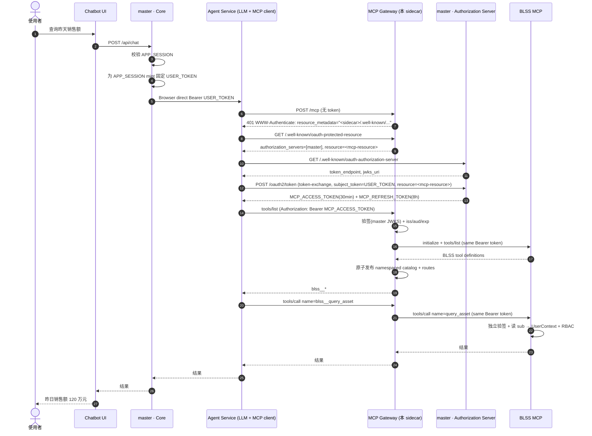
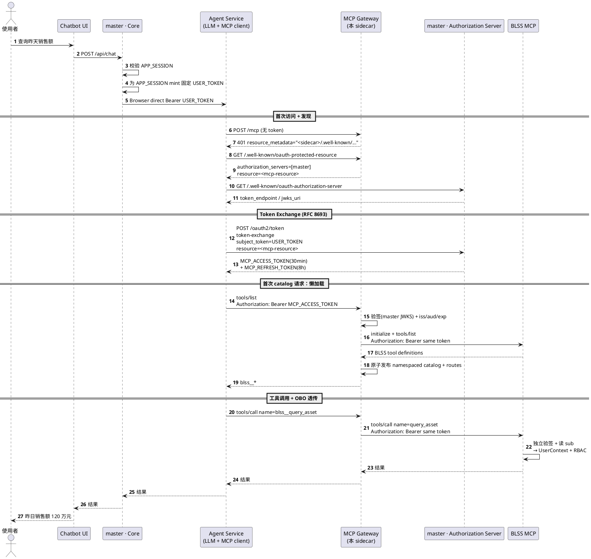

# MCP Gateway 认证流程（On-Behalf-Of）

> 本文档描述 **OBO 网关架构**，取代旧的「sidecar 同时是 Authorization Server + Resource Server」模型。
> 相关：[master-obo-contract.md](master-obo-contract.md)（master 侧前置契约）、
> [openspec/changes/gateway-obo-token-exchange](../openspec/changes/gateway-obo-token-exchange/)。

## 角色转变

这个 sidecar 现在是**纯 MCP Gateway / Resource Server**：

- 它**不再**是 Authorization Server（已移除 `/login`、授权码 + PKCE、动态客户端注册 RFC 7591、consent、本地 JWK 签名、H2 持久化）。
- 它**只**校验由**外部** Authorization Server（master）签发的 `MCP_ACCESS_TOKEN`，然后把该令牌以 `Bearer` 方式透传给选中的 BLSS MCP / Superset MCP backend（On-Behalf-Of）。

授权服务器与用户身份的签发都在 **master**。参与者：

| 角色 | 职责 | 位置 |
|------|------|------|
| Chatbot UI | 用户提问入口 | 前端 |
| Core（master 内） | 已登录浏览器为当前 APP_SESSION mint 固定 `USER_TOKEN`；exchange 时验证 `sid` | master |
| Agent Service | LLM + MCP client，做 token-exchange、缓存令牌、调用工具 | 独立服务 |
| **MCP Gateway（本 sidecar）** | 校验 `MCP_ACCESS_TOKEN`，懒加载/聚合 backend tools，按前缀路由并 OBO 透传 | 本仓库 |
| Authorization Server | RFC 8693 token-exchange、发 `MCP_ACCESS/REFRESH`、公开 JWKS | master |
| BLSS MCP / Superset MCP | 独立验签、读 `sub` 建立用户上下文、执行工具并套用 backend RBAC | backend |

## 需要输入的凭证

| 角色 | 需要提供什么 | 来源 |
|------|-------------|------|
| **Agent Service（MCP 客户端）** | 浏览器直接发送的 session-bound `USER_TOKEN`；完整验证后作为 token-exchange 的唯一凭据 | browser / master AS |
| **MCP Gateway** | 无需凭证。用外部 AS 的 `jwks_uri` 离线验签入站令牌 | `application.yml` 的 `sidecar.issuer-uri` / `jwks-uri` |
| **Backend MCP** | 网关透传的同一个 `MCP_ACCESS_TOKEN`（Bearer JWT，含 `sub`） | 由网关转发 |

## 令牌如何流转（OBO）

1. 用户已登录 master；浏览器为当前 `APP_SESSION` mint 一张固定 `USER_TOKEN`（`sub` 来自 session、`aud=<agent-resource>`、带 `sid`、`exp<=session expiry`），并直接以 Bearer 调 Agent。
2. Agent 完整验证 `USER_TOKEN` 后，首次访问网关 `/mcp`（无 MCP access token）→ 网关回 `401` + RFC 9728 指针。
3. Agent 依指针发现**外部 AS（master）**，向 AS 做 RFC 8693 token-exchange；USER_TOKEN 是唯一凭据，AS 还验证 `sid` session 有效，然后签发 `MCP_ACCESS_TOKEN`（~30min）+ `MCP_REFRESH_TOKEN`（~8h）。V1 无 OAuth scope。
4. Agent 用 `MCP_ACCESS_TOKEN` 作为 Bearer 重新访问网关。
5. 首个需要 catalog 的已认证 `tools/list`，或 catalog 尚未初始化时的 `tools/call`，使用当前请求 token 懒加载 BLSS MCP / Superset MCP 的 `initialize` + `tools/list`；启动时不发现 backend。
6. **网关**按 `<backend>__<tool>` 前缀路由 `tools/call`，把同一个令牌原样以 `Authorization: Bearer` 透传给目标 backend。
7. **Backend MCP** 再次独立验签，读 `sub`，建立用户上下文，套 RBAC 并执行工具。

> Refresh 由 Agent 负责，网关不参与。Refresh 失效时复用浏览器当前 session 的 USER_TOKEN；logout 后 exchange 被拒，已有 MCP access token 自然过期。

> Catalog 的 refresh interval 是 freshness TTL。TTL 过期后由下一个需要 catalog 的已认证请求触发刷新；网关不保留用户 token，也不执行依赖 token 的后台刷新。Catalog 对用户身份无关，RBAC 只在 `tools/call` 时生效。

## 网关侧关键实现点

- **发现挑战**：[McpAuthenticationEntryPoint](../src/main/java/com/optimumpathinc/nexus/mcp/security/McpAuthenticationEntryPoint.java) 对未认证请求回 `401 WWW-Authenticate: Bearer resource_metadata="<sidecar>/.well-known/oauth-protected-resource"`（指针指向本 sidecar，从 `mcp-resource` 的 origin 推导）。
- **保护资源元数据**：[ProtectedResourceMetadataController](../src/main/java/com/optimumpathinc/nexus/mcp/security/ProtectedResourceMetadataController.java) 返回 `resource=<mcp-resource>`、`authorization_servers=[<外部 AS>]`。
- **令牌校验**：[SecurityConfig](../src/main/java/com/optimumpathinc/nexus/mcp/config/SecurityConfig.java) 的 `JwtDecoder` 从 `issuer-uri`/`jwks-uri` 取签名密钥；校验器 = 时间戳（可配 `clock-skew`）+ `iss` + [AudienceValidator](../src/main/java/com/optimumpathinc/nexus/mcp/security/AudienceValidator.java)（`aud` 含 `mcp-resource`）。
- **当前 POC OBO 透传**：[UserTokenCaptureFilter](../src/main/java/com/optimumpathinc/nexus/mcp/security/UserTokenCaptureFilter.java) 从已验证的 `Jwt` 取原始令牌存入 [UserTokenContext](../src/main/java/com/optimumpathinc/nexus/mcp/security/UserTokenContext.java)；[MasterClient](../src/main/java/com/optimumpathinc/nexus/mcp/master/MasterClient.java) 以 `Authorization: Bearer <token>` 调 master REST。目标态由 downstream MCP client 把同一 token 透传给所选 backend，并退役本地 demo tool 路径。
- **目标态工具聚合**：启动时不访问 backend；首个 catalog-dependent 已认证请求触发懒加载。并发加载 single-flight，catalog + 路由表原子发布；首次全部失败返回 MCP error，后续刷新失败保留 last-known-good 定义。

## 关键安全约束：每个 backend 请求都必须验签

无论 BLSS MCP 使用 loopback 还是远程地址，传输都不是身份依据。

- Backend MCP 对每个 `initialize`/`tools/list`/`tools/call` 请求独立校验签名、`iss`/`aud`/`exp`，再信任 `sub`。
- HTTP 连接可以复用，但身份不能从连接或以前的 MCP session 继承。
- 优先使用 stateless Streamable HTTP；SDK 强制 session 时，discovery session 临时创建并关闭，identity-bound session 不跨用户共享。
- 接受 `aud=<mcp-resource>` 是显式的受众白名单，**不等于**跳过验证。
- Gateway + backend 双端验签是刻意的纵深防御。

> 一句话：**连接和 session 都不是用户身份，当前请求 token 才是。**

## 配置项（`application.yml` → `sidecar.*`）

| 键 | 说明 |
|----|------|
| `issuer-uri` | 外部 AS（master）issuer；用于 JWKS 发现、`iss` 校验、元数据 `authorization_servers` |
| `jwks-uri` | 可选，显式 JWKS 端点；留空则从 `issuer-uri` 发现 |
| `mcp-resource` | 本网关代表的资源标识（RFC 8707）；入站令牌 `aud` 必含；元数据 `resource` |
| `clock-skew` | 校验 `exp`/`nbf` 的允许时钟偏移（默认 60s） |
| `catalog-freshness-ttl` | Catalog freshness TTL，默认 10m |
| `catalog-failure-backoff` | Discovery/refresh 失败后的重试退避，默认 30s |
| `backends` | 静态 backend registry，v1 首先配置 BLSS MCP；Superset 后置 |

## Mermaid 序列图

## PlantUML 序列图

