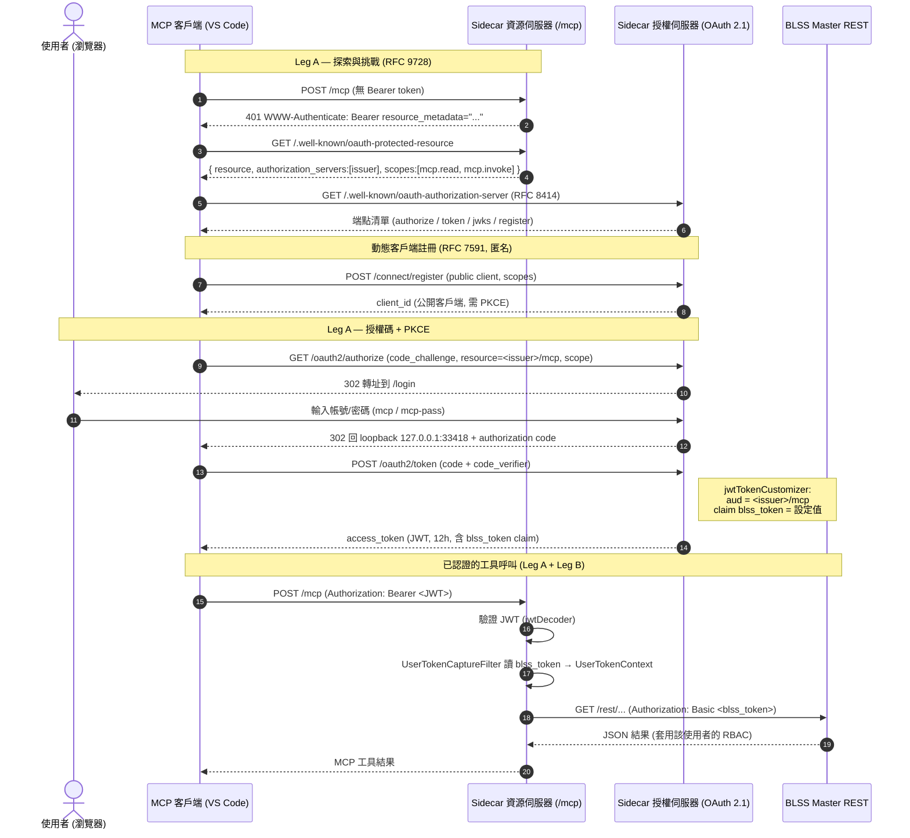
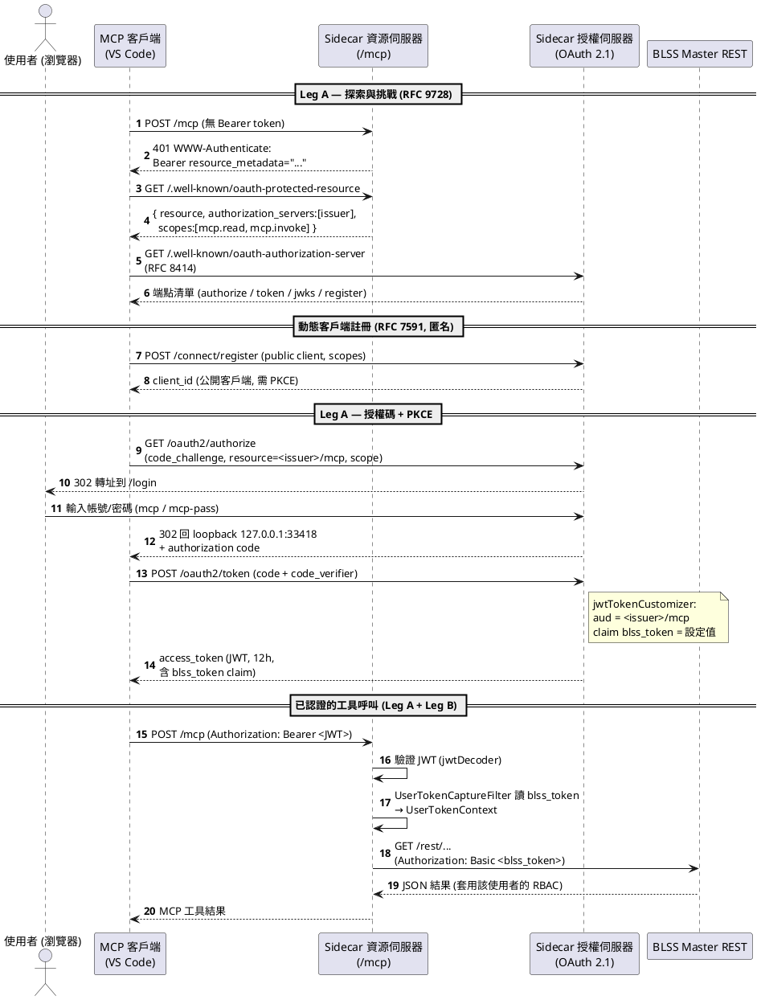

# MCP Server OAuth 2.1 認證流程

這個 sidecar 同時扮演 **Authorization Server（授權伺服器）** 和 **Resource Server（資源伺服器）**，認證分成兩條「腿」（two legs）：

- **Leg A — OAuth 2.1**：VS Code（MCP 客戶端）↔ sidecar 之間的信任，用 Bearer JWT + PKCE。
- **Leg B — On-Behalf-Of（代理身分）**：sidecar → BLSS master REST，用 `blss_token` 轉成 HTTP Basic 認證，讓 master 以「真實使用者」身分套用 RBAC。

## 需要輸入的憑證

| 角色 | 需要提供什麼 | 來源 |
|------|-------------|------|
| **MCP 客戶端（VS Code）** | 無 client secret（公開客戶端），但**必須用 PKCE**（`code_challenge` / `code_verifier`）；`client_id` 由動態註冊 RFC 7591 取得，或使用預先種入的 `mcp-vscode` | `AuthorizationServerConfig.java` |
| **使用者（User）** | 在 `/login` 頁面輸入**帳號 / 密碼**（POC 預設 `mcp` / `mcp-pass`）作為 resource owner 登入 | `SecurityConfig.java`, `application.yml` |
| **BLSS token** | 使用者**不需輸入**；由設定檔提供固定值，見下方 | `application.yml` |

## blss-token 是如何設置的

1. **設定來源**：`sidecar.blss-user-token`（`application.yml`），是 `user:password` 的 Base64（目前預設值解碼後為 `gl:...`）。
2. **寫入 JWT**：發 token 時，`jwtTokenCustomizer` 把這個值當作 `blss_token` claim 塞進存取權杖（access token）。同時把 `aud` 綁定到 RFC 8707 的 `resource`（`<issuer>/mcp`）。
3. **取回**：資源伺服器驗證 JWT 後，`UserTokenCaptureFilter` 從 `blss_token` claim 讀出（找不到時退回讀 `X-BLSS-User-Token` 標頭），存進 `ThreadLocal`（`UserTokenContext`）。
4. **轉發**：工具呼叫時，`MasterClient` 讀出該值，以 `Authorization: Basic <blss_token>` 呼叫 master REST。

> 補充：access token 存活 12 小時（`ACCESS_TOKEN_TTL`），且互動式同意（consent）被關閉，因此 `/oauth2/authorize` 授權後直接跳回 loopback，避免 VS Code 反覆彈出 "Allow"。

---

## Leg A 各請求詳解

整條 Leg A 的設計核心：**客戶端零設定自動發現**（401 → 兩層 well-known）＋ **公開客戶端用 PKCE 取代 client secret** ＋ **長效 token／免 consent** 來避開 VS Code 的重複授權彈窗。

### 階段一：探索與挑戰（RFC 9728 / RFC 8414）

**1–2. `POST /mcp`（無 token）→ `401 WWW-Authenticate`**

VS Code 第一次連線時還沒有任何憑證，直接打 MCP 端點。資源伺服器攔下來回傳 `401`，並在 header 塞入「去哪裡拿 metadata」的指示：

```
WWW-Authenticate: Bearer resource_metadata="<issuer>/.well-known/oauth-protected-resource"
```

- 出處：`McpAuthenticationEntryPoint`（`security/McpAuthenticationEntryPoint.java`）。
- 掛載點：`/mcp` 的 resource-server chain 用 `.authenticationEntryPoint(...)` 指定它（`config/SecurityConfig.java`）。
- **重點**：這不是錯誤，而是 OAuth 的「觸發器」。VS Code 把這個 401 當成「我該去跑 OAuth 了」的訊號。

**3–4. `GET /.well-known/oauth-protected-resource`（RFC 9728）**

VS Code 依上一步 header 裡的 URL 抓「受保護資源的 metadata」，得到：

```json
{
  "resource": "<issuer>/mcp",
  "authorization_servers": ["<issuer>"],
  "bearer_methods_supported": ["header"],
  "scopes_supported": ["mcp.read", "mcp.invoke"]
}
```

- 出處：`ProtectedResourceMetadataController`（`security/ProtectedResourceMetadataController.java`）。
- **重點**：告訴客戶端兩件事 —「保護我的授權伺服器是誰」（`authorization_servers`）＋「等一下 token 要綁到哪個 resource」（`resource`，即 RFC 8707 的 audience）。這裡授權伺服器就是 sidecar 自己。

**5–6. `GET /.well-known/oauth-authorization-server`（RFC 8414）**

知道授權伺服器是誰後，VS Code 再抓「授權伺服器的 metadata」，拿到所有端點清單：`authorization_endpoint`、`token_endpoint`、`jwks_uri`、`registration_endpoint` 等。

- 這是 Spring Authorization Server 內建端點（`.oidc(Customizer.withDefaults())` 啟用，`config/AuthorizationServerConfig.java`）。
- **重點**：客戶端完全零設定（zero-config）。它從一個 401 開始，靠兩層 well-known 文件自動發現整個 OAuth 拓撲。

### 階段二：動態客戶端註冊（RFC 7591，匿名）

**7–8. `POST /connect/register` → 回傳 `client_id`**

VS Code 沒有預先配置的 `client_id`，於是匿名自我註冊一個「公開客戶端」，並宣告要哪些 scope（`mcp.read` / `mcp.invoke`）。

- 開放匿名註冊：`.openRegistrationAllowed(true)`；允許 POST 匿名通過：`.requestMatchers(HttpMethod.POST, "/connect/register").permitAll()`（`config/AuthorizationServerConfig.java`）。
- **關鍵客製**：Spring 預設驗證器在匿名註冊時會**禁止帶 scope**（防提權）。這裡換成 `SIMPLE_SCOPE_VALIDATOR`，保留 redirect_uri / jwks 的嚴格檢查，但**放行 scope**，讓客戶端能註冊出帶 `mcp.read`/`mcp.invoke` 的客戶端。
- **備援**：另外預先種了一個靜態公開客戶端 `mcp-vscode`，給無法動態註冊的客戶端當 fallback。註冊結果寫進 DB（`JdbcRegisteredClientRepository`），重啟後 `client_id` 依然有效，避免 VS Code 反覆用失效 id 打 authorize 造成 400 迴圈。

因為是**公開客戶端（無 secret）**，後續**強制 PKCE**（`requireProofKey(true)`）。

### 階段三：授權碼 + PKCE

**9–10. `GET /oauth2/authorize` → `302` 轉到 `/login`**

VS Code 開瀏覽器打 authorize 端點，帶上：

- `code_challenge`（PKCE，`code_verifier` 的雜湊，verifier 自己留著）
- `resource=<issuer>/mcp`（RFC 8707，要求 token 綁到這個 audience）
- `scope=mcp.read mcp.invoke`

此時使用者還沒登入（沒有 session），授權伺服器把 HTML 請求轉址到登入頁 —
`LoginUrlAuthenticationEntryPoint("/login")` + `MediaTypeRequestMatcher(TEXT_HTML)`（`config/AuthorizationServerConfig.java`）。

**11–12. 使用者輸入帳密（`mcp` / `mcp-pass`）**

使用者在 `/login` 表單登入，完成 resource owner 認證。

- 登入頁：`.formLogin(...)` 在 default chain（`config/SecurityConfig.java`）。
- 帳密來源：`userDetailsService(...)` 的 POC 記憶體使用者，值來自 `application.yml` 的 `sidecar.auth-username` / `auth-password`。

**12–13. `302` 回 loopback + authorization code**

登入成功後，因為**同意（consent）被關閉**（`requireAuthorizationConsent(false)`），授權伺服器不再彈「Allow」，直接把 authorization code 透過 302 送回 VS Code 的 loopback（`http://127.0.0.1:33418/`）。

**14. `POST /oauth2/token`（code + code_verifier）→ access token**

VS Code 拿 code 換 token，附上原始 `code_verifier`。授權伺服器重算 PKCE 雜湊、比對 `code_challenge`，通過後簽發 JWT access token。簽發時 `jwtTokenCustomizer` 做兩件事：

1. **綁定 audience**：把 `aud` 設成客戶端要求的 `resource`（`<issuer>/mcp`），若無則預設。MCP 規範要求 token 必須綁到該 resource，否則客戶端會拒收並無限重試。
2. **塞入 Leg B token**：把 `blss_token` claim 寫進 access token，供資源伺服器後續轉發給 master REST。

- token 存活 12 小時（`ACCESS_TOKEN_TTL`）：公開 PKCE 客戶端拿不到 refresh token，短 TTL 會逼 VS Code 反覆重跑 OAuth（Allow 迴圈），故刻意拉長。
- 簽章金鑰持久化到 `data/jwk.json`，避免重啟後舊 token 全失效。

### 一句話總結各請求的角色

| # | 請求 | 目的 |
|---|------|------|
| 1–2 | `POST /mcp` → 401 | 觸發器：告知客戶端「去發現授權伺服器」 |
| 3–4 | protected-resource metadata | 發現：授權伺服器是誰、token 要綁哪個 resource |
| 5–6 | authorization-server metadata | 發現：各 OAuth 端點 URL |
| 7–8 | `POST /connect/register` | 取得 `client_id`（匿名，帶 scope） |
| 9–10 | `GET /oauth2/authorize` | 開始授權碼流程，未登入 → 轉登入頁 |
| 11–12 | `/login` 帳密 | resource owner 認證 |
| 12–13 | 302 回 loopback | 交付 authorization code（免 consent） |
| 14 | `POST /oauth2/token` | 驗 PKCE，簽發綁 audience + 含 `blss_token` 的 JWT |

---

## Mermaid 序列圖



---

## PlantUML 序列圖


