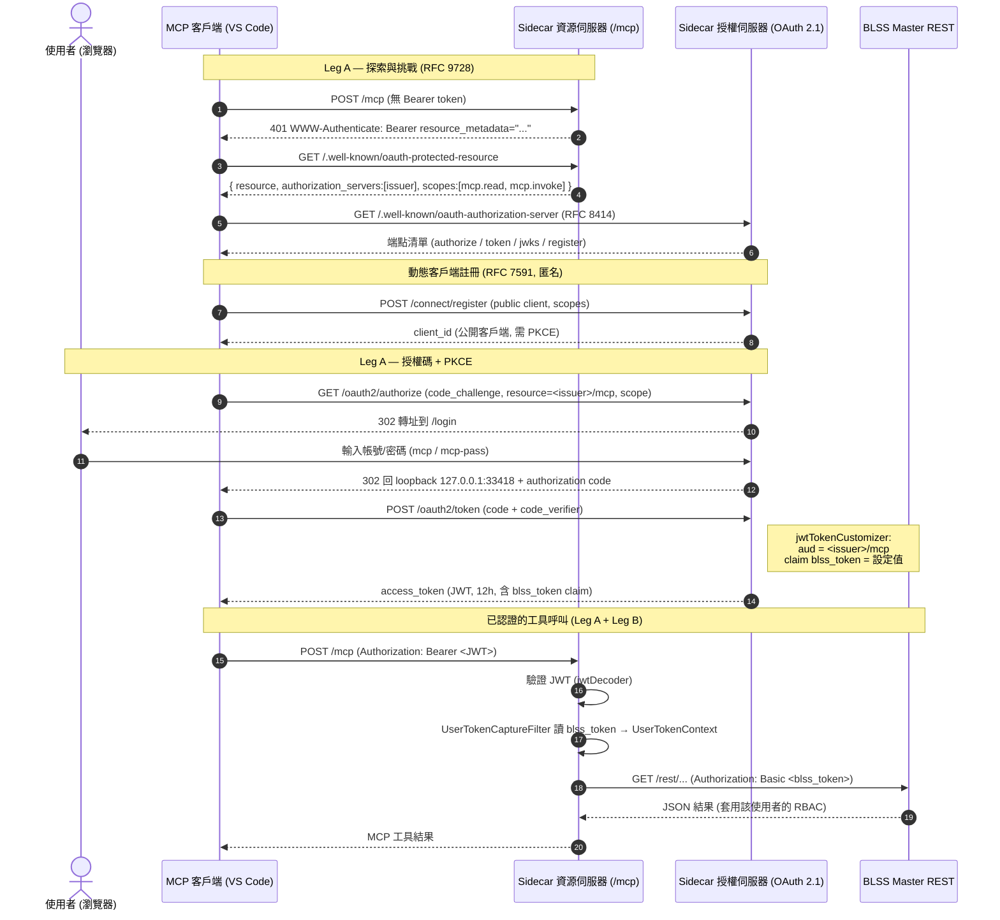
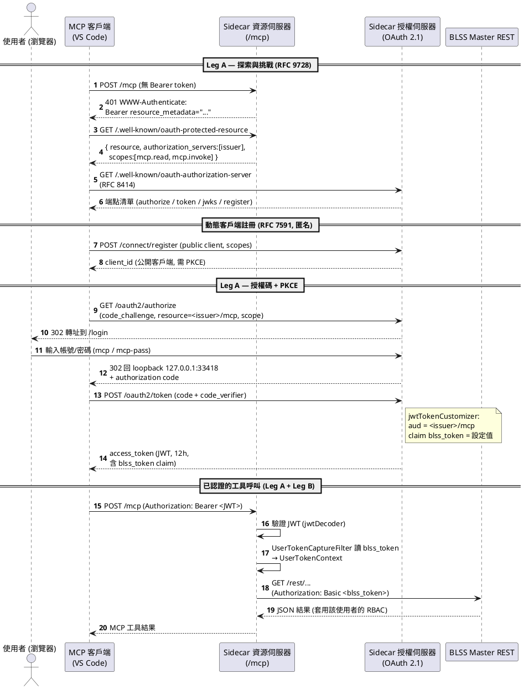

# MCP Server OAuth 2.1 認證流程

這個 sidecar 同時扮演 **Authorization Server（授權伺服器）** 和 **Resource Server（資源伺服器）**，認證分成兩條「腿」（two legs）：

- **Leg A — OAuth 2.1**：VS Code（MCP 客戶端）↔ sidecar 之間的信任，用 Bearer JWT + PKCE。
- **Leg B — On-Behalf-Of（代理身分）**：sidecar → BLSS master REST，用 `blss_token` 轉成 HTTP Basic 認證，讓 master 以「真實使用者」身分套用 RBAC。

## 需要輸入的憑證

| 角色 | 需要提供什麼 | 來源 |
|------|-------------|------|
| **MCP 客戶端（VS Code）** | 無 client secret（公開客戶端），但**必須用 PKCE**（`code_challenge` / `code_verifier`）；`client_id` 由動態註冊 RFC 7591 取得，或使用預先種入的 `mcp-vscode` | `AuthorizationServerConfig.java` |
| **使用者（User）** | 在 `/login` 頁面輸入**帳號 / 密碼**（POC 預設 `mcp` / `mcp-pass`）作為 resource owner 登入 | `SecurityConfig.java`, `application.yml` |
| **BLSS token** | 使用者**不需輸入**；由設定檔提供固定值，見下方 | `application.yml` |

## blss-token 是如何設置的

1. **設定來源**：`sidecar.blss-user-token`（`application.yml`），是 `user:password` 的 Base64（目前預設值解碼後為 `gl:...`）。
2. **寫入 JWT**：發 token 時，`jwtTokenCustomizer` 把這個值當作 `blss_token` claim 塞進存取權杖（access token）。同時把 `aud` 綁定到 RFC 8707 的 `resource`（`<issuer>/mcp`）。
3. **取回**：資源伺服器驗證 JWT 後，`UserTokenCaptureFilter` 從 `blss_token` claim 讀出（找不到時退回讀 `X-BLSS-User-Token` 標頭），存進 `ThreadLocal`（`UserTokenContext`）。
4. **轉發**：工具呼叫時，`MasterClient` 讀出該值，以 `Authorization: Basic <blss_token>` 呼叫 master REST。

> 補充：access token 存活 12 小時（`ACCESS_TOKEN_TTL`），且互動式同意（consent）被關閉，因此 `/oauth2/authorize` 授權後直接跳回 loopback，避免 VS Code 反覆彈出 "Allow"。

---

## Mermaid 序列圖

---

## PlantUML 序列圖

