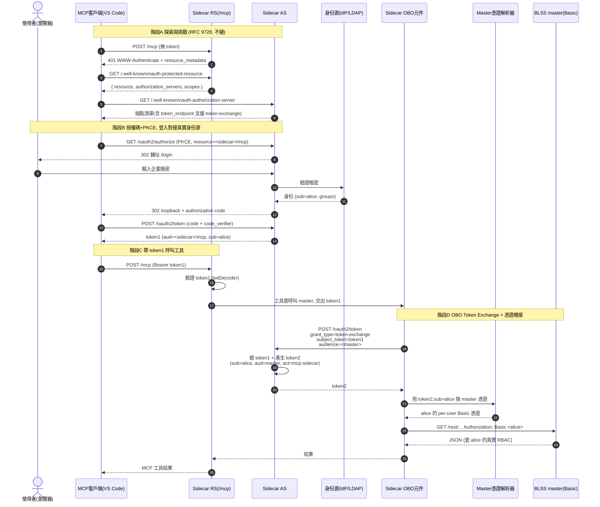
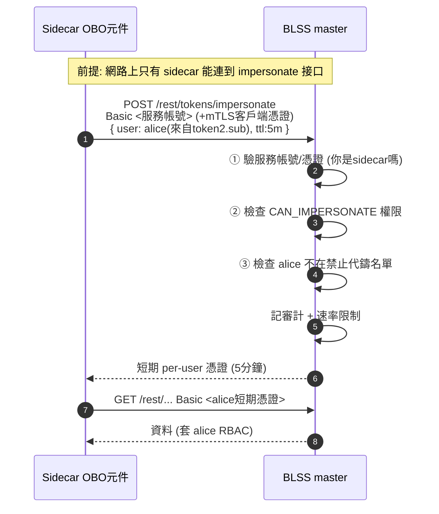

# 路線 2：真·OAuth2 OBO（RFC 8693 Token Exchange）設計

> 把現在「所有人共用一個寫死的 `blss_token`」改成「**登入的人 = master 看到的人**」，並用標準的
> **RFC 8693 Token Exchange** 表達「sidecar 代表某使用者去呼叫 master」這層委派關係。

---

## 1. 目標與範圍

現況（Phase 0）是「披著 OBO 外衣的共享服務憑證」：`sidecar.blss-user-token` 是寫死的固定值
（解碼為 `gl:密碼`），任何人登入都被塞同一個 `blss_token`，master 永遠看到同一個使用者 `gl`。

本設計要讓委派變真的，並分兩階段落地：

```
Phase 0 (現狀)        Phase 1 (本設計主體)              Phase 2 (終態)
共享固定 blss_token  →  真身份登入 + Token Exchange   →  master 變 OAuth2 RS
                        + Master憑證橋接(補 Basic)       直接轉發 token2, 拔掉橋接
```

**已知問題：master 只有 Basic 認證。** 這個問題由 Phase 1 的
「Master 憑證解析器（Credential Resolver）」橋接件承接，等 Phase 2 master 能認 JWT 時拔掉。

---

## 2. 角色定義

| 角色 | 職責 | 現在有嗎 |
|------|------|---------|
| **MCP 客戶端 (VS Code)** | 公開 PKCE 客戶端，拿 token1 呼叫 `/mcp` | ✅ 不變 |
| **使用者 (瀏覽器)** | resource owner，輸入**企業帳密** | ✅ 但目前是 demo `mcp` |
| **身份源 IdP / LDAP / AD** | 真實使用者身份的權威來源 | ❌ 要接 |
| **Sidecar 授權伺服器 (AS)** | 簽 token1；**新增 token-exchange grant** 簽 token2 | 🔶 要擴充 |
| **Sidecar 資源伺服器 (RS `/mcp`)** | 驗 token1 | ✅ 不變 |
| **Sidecar OBO 元件** | 拿 token1 去 AS 換 token2，再呼叫 master | ❌ 要新建 |
| **Master 憑證解析器 (Resolver)** | 把 token2 的 `sub` 映射成 master 的 per-user Basic 憑證（補 Basic 的橋） | ❌ 要新建 |
| **BLSS master REST** | 下游，目前只認 Basic | 🔶 Phase 1 幾乎不動 / Phase 2 變 RS |

---

## 3. Token 設計（兩張 token 的關係）

這是整個 OBO 的核心，務必分清楚：

```
token1  ── VS Code 拿著呼叫 /mcp
  iss = <sidecar>
  sub = alice            ← 真實使用者
  aud = <sidecar>/mcp    ← 只能用來進 sidecar
  scope = mcp.read mcp.invoke

        │  token exchange (RFC 8693)
        ▼
token2  ── sidecar 拿著去呼叫 master（代表 alice）
  iss = <sidecar>
  sub = alice            ← 身份原封不動傳遞
  aud = <master>         ← 只能用來打 master
  act = { sub: "mcp-sidecar" }   ← actor: 誰在代表 alice 行動
  scope = master.read (下游最小權限)
```

`act`（actor claim）是 RFC 8693 的靈魂：明確記錄「**是 sidecar 這個服務，代表 alice** 去呼叫
master」，審計時能還原整條委派鏈，而不是偽裝成 alice 本人。

Token Exchange 請求（sidecar → 自身 `/oauth2/token`）：

```
grant_type          = urn:ietf:params:oauth:grant-type:token-exchange
subject_token       = <token1>
subject_token_type  = urn:ietf:params:oauth:token-type:access_token
audience            = <master 的 resource 識別碼>
requested_token_type= urn:ietf:params:oauth:token-type:access_token
```

---

## 4. 時序圖（Phase 1 完整流程）



> Phase 2 只改「階段 D 尾巴」：`Resolver` 拿掉，`OBO` 直接把 `token2` 當 `Authorization: Bearer`
> 丟給 master，master 自己驗簽 + 按 `sub` 套 RBAC。

---

## 5. 每個步驟詳解

**階段 A（1–7）探索與挑戰** — 完全沿用現狀（`ProtectedResourceMetadataController`、
`McpAuthenticationEntryPoint`）。唯一差別：AS metadata 要宣告支援 token-exchange grant。

**階段 B（8–15）真身份登入** — **本設計最大的行為改變**。

- 步驟 12：`/login` 不再打內存 demo 使用者，改成把帳密送到**真實身份源**驗證。
- 步驟 13：拿回 `sub`（穩定使用者 ID）與 `groups`（給下游 RBAC / scope 用）。
- 步驟 15：token1 的 `sub` 現在是**真實使用者**，不再是 `mcp`。`blss_token` claim **整個移除**。

**階段 C（16–18）** — RS 驗 token1 不變。差別是驗完不再從 claim 直接讀 blss_token，而是把 token1
往下交給 OBO 元件。

**階段 D（19–26）OBO 核心** —

- 步驟 19–21：sidecar 把 token1 送回自己的 `/oauth2/token`，用
  `grant_type=urn:ietf:params:oauth:grant-type:token-exchange` 換出 token2（`aud=master`、帶 `act`）。
- 步驟 22–23：**橋接件**用 token2 的 `sub` 去解析 master 的 per-user Basic 憑證（補「master 只有 Basic」）。
- 步驟 24：發 `Basic <alice>` 呼叫 master，master 自然套 alice 的 RBAC。

---

## 6. 每個角色要做的工作

### 身份源 IdP / LDAP（新接）

- 提供帳密驗證接口，回傳穩定 `sub` 與群組。
- 決定 `sub` 的形式（LDAP DN？email？員工號？）——**這個 ID 要能被 master 認出來對應到 master 使用者**，
  否則橋接無從映射。

### Sidecar AS（擴充）— `AuthorizationServerConfig.java`

- 啟用 / 實作 token-exchange grant（Spring Authorization Server 1.3+ 有內建
  `OAuth2TokenExchangeAuthenticationProvider`，舊版需自定義 provider）。
- 註冊一個**機密客戶端** `mcp-sidecar`（有 secret），因為 token exchange 是後端對後端，不該用 public client。
- token2 的 customizer：設 `aud=<master>`、注入 `act={sub:"mcp-sidecar"}`、下游最小 scope。
- **移除** `jwtTokenCustomizer` 裡塞 `blss_token` 的那段。

### Sidecar 登入（改）— `SecurityConfig.java`

- 把 `InMemoryUserDetailsManager`（demo `mcp/mcp-pass`）換成對接 IdP 的 `UserDetailsService` /
  `AuthenticationProvider`。

### Sidecar OBO 元件（新建）

- 一個 service：輸入 token1 → 呼叫 token-exchange → 得 token2 → 交給 Resolver → 設定 master 認證頭。
- 取代現在 `UserTokenCaptureFilter` 從 claim 讀 token 的做法。可加短期快取（同一 token1 期間不必反覆 exchange）。

### Master 憑證解析器（新建，橋接件）

- 契約：`resolve(sub, act, scopes) → master Basic 憑證`。
- 三種實作可選（見第 7 節）。

### MasterClient（小改）— `MasterClient.java`

- Phase 1：仍發 `Basic`，但值來自 Resolver 而非 `ThreadLocal` 裡的固定 claim。
- Phase 2：改發 `Bearer token2`。建議把「認證頭怎麼組」抽成策略，讓 Phase 1→2 只換實作。

### BLSS master（Phase 1 幾乎不動 / Phase 2 大改）

- 見第 7 節三選一。

---

## 7. 「master 只有 Basic」的橋接方案（三選一）

| 方案 | master 端改動 | 安全性 | 適用 |
|------|--------------|--------|------|
| **B1 憑證保管庫** | **零**。sidecar 讀一個 `sub → per-user Basic` 的保管庫（vault / 加密表），由管理員預先為每個使用者建 master API 憑證 | 中（憑證要安全保存 + 輪替） | master 完全不能動時 |
| **B2 管理員代鑄接口** ⭐ | **極小**。master 加一個 `POST /rest/tokens/impersonate?user=<sub>`，sidecar 用服務管理員身份呼叫，換回該使用者短期 per-user token | 高（短期、可撤銷、不存明文） | 推薦：改動小又乾淨 |
| **B0 終態：master 變 OAuth2 RS** | **大**。master 拿 sidecar JWKS 驗簽、按 `sub` 建 UserContext | 最高 | Phase 2 |

**推薦 Phase 1 用 B2**：master 只需加一支「代某使用者鑄短期憑證」的接口，就能讓 sidecar 拿到真正
per-user 的 Basic，橋接乾淨且可審計。等哪天走 B0，Resolver 直接退場。

### 7.1 B2 下 master 如何認證 sidecar（信任邊界核心）

impersonate 接口「能為任意使用者鑄 token」，權力比任何普通使用者都大，因此「master 怎麼認 sidecar」
直接決定整個 OBO 的安全下限。呼叫時 master 要同時確認三件事：

```
① 認證(AuthN): 你真的是 sidecar 這個服務嗎?   → 服務身份憑證
② 授權(AuthZ): 這服務被允許代鑄任意使用者嗎?  → 特殊權限 CAN_IMPERSONATE, 普通帳號沒有
③ 代誰(Subject): user=<sub> 可信嗎?           → sidecar 的斷言, 其可信度 = ①的強度
```

**關鍵認知**：master 是「信任 sidecar 的斷言」——sidecar 說「幫 alice 鑄一個」，master 就照做。
所以一旦 ① 的服務憑證外洩，攻擊者就能冒充任何人。因此 ① 要盡量強，並用縱深防禦兜底。

**master 認 sidecar 的機制（① 的選項）**

| 機制 | master 要做的事 | 強度 | 說明 |
|------|----------------|------|------|
| **專用服務帳號 (Basic)** ⭐ 起步 | 建一個帶 `CAN_IMPERSONATE` 權限的服務帳號 | 中 | 與 master 現有 Basic 一致，最快。靜態高價值密鑰，必須進 vault + 輪替 |
| **mTLS 雙向憑證** ⭐ 加固 | 在 master／閘道校驗客戶端憑證 | 高 | 服務身份綁到憑證，密鑰不隨請求走，防重放/竊聽 |
| **API Key / 專用強密鑰頭** | 比對一個 header | 中 | 跟 Basic 差不多，換個形式 |
| **HMAC 簽名請求** | 共享密鑰驗簽 + 時間戳/nonce | 中高 | 防重放，但要實作簽名邏輯 |
| **網路隔離 / IP allowlist** | 只放行 sidecar 主機來源 | （疊加項） | 不能單獨用，疊加後大幅收斂攻擊面 |

**建議組合**：`專用服務帳號(Basic) + mTLS + 網路只允許 sidecar 來源`。第一版可先做
「服務帳號 + IP allowlist」上線，mTLS 之後補。

**加固後的 impersonate 接口契約**

```
POST /rest/tokens/impersonate
Authorization: Basic <sidecar 服務帳號>        ← ① 認證(該帳號需 CAN_IMPERSONATE 權限 ②)
（若走 mTLS）客戶端憑證 CN = mcp-sidecar        ← ① 更強的服務身份
Body: { "user": "alice", "ttl": "5m",          ← ③ 代誰 + 短命
        "actor": "mcp-sidecar" }               ← 審計用: 記錄委派鏈

回應: { "token": "<alice 的短期 per-user 憑證>", "expires_in": 300 }
```

**master 端必做的加固**

1. **獨立特權**：服務帳號只有 `CAN_IMPERSONATE`，**不是**普通使用者、不能直接讀業務資料。
2. **鑄出來的 token 要短命 + 可撤銷**（例：5 分鐘），把外洩窗口壓到最小。
3. **禁止代鑄高權限使用者**：加黑名單（不能 impersonate admin / 其他服務帳號），否則等於提權後門。
4. **全量審計**：每次「誰、代誰、何時、來源 IP」落審計日誌，配速率限制 / 異常偵測。
5. **`user` 參數的來源**：sidecar 端這個 `sub` 必須來自**驗過的 token2**，不能是外部可控輸入。

**信任鏈時序圖**



**取捨提醒**：B2 的安全性天花板 = sidecar 服務憑證的保護強度。

- **B2**：master 信任「sidecar 說某人是 alice」→ 信任的是**服務**。
- **Phase 2**：master 自己驗 token2 簽章 → 信任的是**簽發者（AS）的密鑰**，sidecar 被攻破也偽造不出簽章。

B2 是「用一個高價值服務密鑰換取 master 不用改認證」的折衷，短期合理，長期仍應往 Phase 2 收斂。

---

## 8. 需要做的事情清單（Tasks）

**先決 / 決策**

- [ ] 確認身份源（IdP / LDAP / AD？`sub` 用什麼欄位）
- [ ] 確認 master 對應：sidecar 的 `sub` 如何對到 master 使用者
- [ ] 選定橋接方案 B1 / B2

**Sidecar — AS**

- [ ] 啟用 / 實作 token-exchange grant
- [ ] 註冊機密客戶端 `mcp-sidecar`
- [ ] token2 customizer：`aud=master` + `act` + 下游 scope
- [ ] 移除 `blss_token` claim 注入

**Sidecar — 登入**

- [ ] `UserDetailsService` 對接真實身份源，下線 demo 使用者

**Sidecar — OBO / Master**

- [ ] 新建 OBO 交換 service（含短期快取）
- [ ] 新建 Master 憑證解析器（依 B1/B2 實作）
- [ ] `MasterClient` 認證頭抽成策略（Phase 1 Basic / Phase 2 Bearer）
- [ ] 調整 / 退役 `UserTokenCaptureFilter`

**Master（待補）**

- [ ] B2：新增 `impersonate` 代鑄接口（或 B1：建 per-user 憑證保管庫）
- [ ] Phase 2（未來）：master 變 OAuth2 resource server

**配置 / 清理**

- [ ] 移除 `sidecar.blss-user-token` 與相關 demo 設定
- [ ] 新增 master resource 識別碼、OBO client secret、Resolver 設定

---

## 9. 風險與未決問題

1. **`sub` 對映是整個設計的地基**。sidecar 的使用者 ID 若無法穩定對到 master 使用者，B1/B2 都建不起來。
2. **雙 token 生命週期**：token2 要短命且不外洩；OBO 快取要在 token1 過期或撤銷時失效。
3. **Spring Authorization Server 版本**：內建 token-exchange 在較新版本才有，要先確認版本。
4. **master 代鑄接口的信任邊界**（B2）：那支接口權力很大，必須只認 sidecar 的服務身份 + 網路隔離。
